# Panduan Pengguna Jastip Katalog

Panduan ini mengikuti tampilan aplikasi versi 1.0.0. Jastip Katalog membantu Anda menyiapkan katalog produk jastip, mencatat titipan pembeli, dan memantau daftar belanja per trip. Data utama disimpan secara lokal pada perangkat atau browser yang digunakan; buat backup sebelum berpindah perangkat, mengganti browser, atau menghapus data aplikasi.

Gambar di panduan ini diambil dari aplikasi dengan data contoh. Nama pembeli, produk, harga, dan tanggal kurs pada gambar hanya ilustrasi. Tampilan dapat sedikit berbeda menurut ukuran layar dan platform.

## Mulai cepat

1. Buka **Pengaturan** dan buat trip melalui **Tambah trip**. Isi nama serta mata uang belanja. Aplikasi mengambil kurs mata uang tersebut ke rupiah dan menyimpannya untuk trip.
2. Di tab **Trip**, pilih **Tambah produk**. Tambahkan foto, nama produk, dan harga asli dalam mata uang trip, lalu pilih **Simpan produk**.
3. Buka produk untuk melihat detail katalog. Pada **Checklist pembeli**, pilih **Tambah**, isi nama pembeli, jumlah, dan catatan, lalu simpan.
4. Saat produk sudah dibeli, centang pembeli yang bersangkutan. Pantau ringkasannya di tab **Trip** dan rincian per orang di tab **Pembeli**.
5. Buka **Pengaturan → Backup** secara berkala untuk menyimpan salinan data yang dapat dipulihkan.

## Mengenal empat tab utama

| Tab | Kegunaan |
| --- | --- |
| **Trip** | Melihat trip aktif, kurs, produk, dan ringkasan belanja. Di sini Anda menambah produk serta mengekspor atau mengimpor checklist. |
| **Pembeli** | Melihat titipan yang dikelompokkan menurut nama pembeli, lengkap dengan jumlah, nilai, dan status belanja. |
| **Produk** | Menelusuri semua produk dalam trip aktif melalui pencarian, kategori, dan filter. |
| **Pengaturan** | Mengelola trip, kurs, aturan harga, ekspor Excel, backup, restore, dan changelog. |

Di layar lebar, tab tampil sebagai menu di sisi kiri; di layar kecil, tab berada di bagian bawah. Nama trip aktif dapat diganti dari pemilih trip di halaman **Trip** atau dari **Pengaturan**.

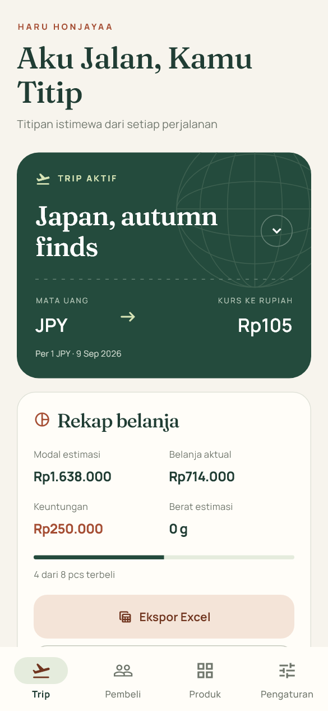

*Halaman Trip menampilkan kurs yang tersimpan dan ringkasan belanja dari checklist pembeli.*

## Mengatur trip dan kurs

### Membuat dan memilih trip

Di **Pengaturan**, tekan **Tambah trip**, masukkan nama dan pilih mata uang. Setiap trip memiliki produk, pembeli, dan pengaturan harga sendiri. Pilih trip aktif melalui daftar **Trip aktif** atau nama trip di halaman **Trip**.

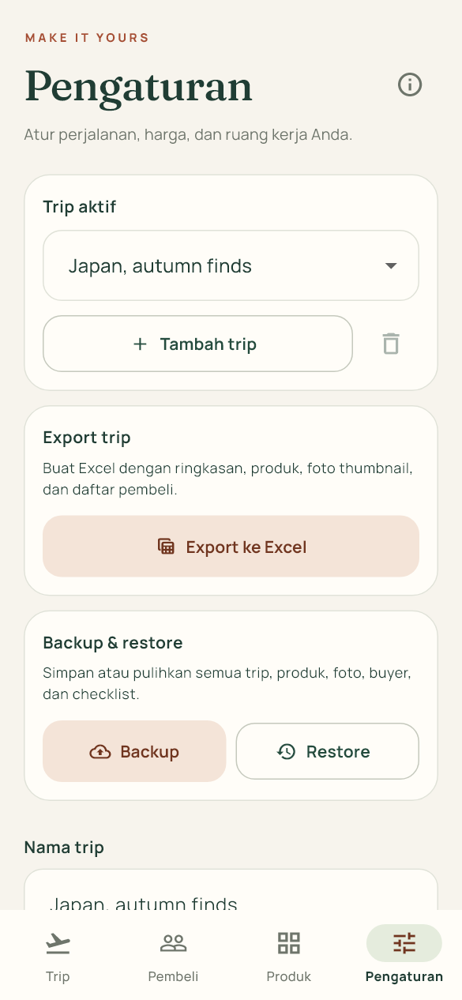

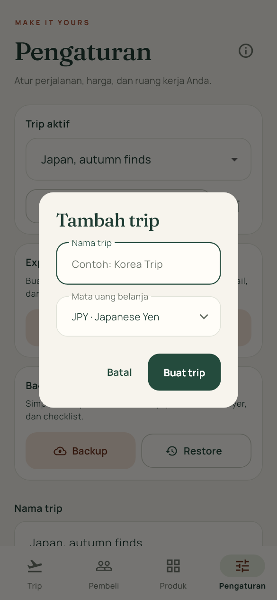

Kurs disimpan saat trip dibuat. Membuka aplikasi atau berpindah ke trip yang sudah memiliki kurs tidak mengambil kurs baru secara otomatis. Jika kurs belum tersedia pada trip default atau data lama, aplikasi akan mencoba mengisinya. Tanggal yang tampil pada kartu kurs adalah tanggal kurs dari penyedia, yang dapat berbeda dengan hari Anda membuka aplikasi.

Jika ingin memakai kurs baru, tekan ikon **Perbarui kurs** di **Pengaturan** dan konfirmasi. Seluruh harga jual produk dalam trip itu akan dihitung ulang. Mengganti mata uang belanja lalu menyimpan pengaturan juga mengambil kurs mata uang baru dan menghitung ulang harga. Periksa harga katalog sebelum membagikan ulang gambar yang pernah dibuat.

Kurs berasal dari Frankfurter dan dapat berbeda dari kurs transaksi sebenarnya. Jika jaringan tidak tersedia, aplikasi dapat memakai kurs yang pernah tersimpan dalam cache. Perhatikan tanggal kurs sebelum membuat keputusan harga.

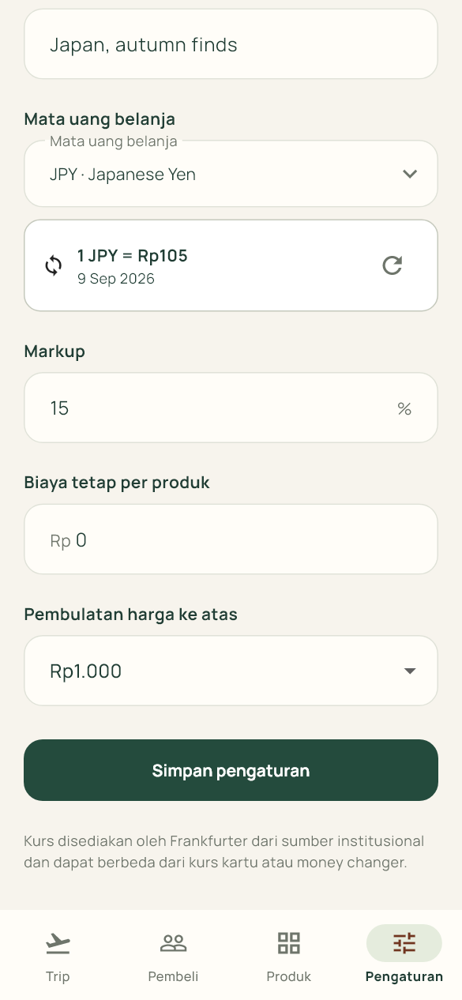

*Ikon panah melingkar pada kartu kurs menjalankan pembaruan setelah Anda menyetujui dialog konfirmasi.*

### Mengatur harga

Di **Pengaturan**, Anda dapat mengubah **Markup**, **Biaya tetap per produk**, dan **Pembulatan harga ke atas**, lalu menekan **Simpan pengaturan**. Harga jual produk dalam trip dihitung ulang berdasarkan pengaturan terbaru. Produk yang memakai **Harga khusus produk** menggunakan margin dan biaya tetapnya sendiri.

Ringkasan **Modal estimasi**, **Belanja aktual**, dan **Keuntungan** dihitung dari data produk, kurs trip, jumlah titipan, dan status pembelian. Angka **Belanja aktual** di sini adalah perhitungan modal untuk item yang ditandai terbeli, bukan pencatatan nominal struk atau pembayaran riil. Simpan bukti transaksi terpisah jika Anda membutuhkan pembukuan akuntansi yang presisi.

## Mengelola produk dan katalog

### Menambah produk

Di tab **Trip**, tekan **Tambah produk**. Pilih foto dari kamera atau galeri, lalu isi nama dan harga asli. Masukkan harga tanpa pemisah ribuan. Pratinjau harga katalog muncul pada formulir.

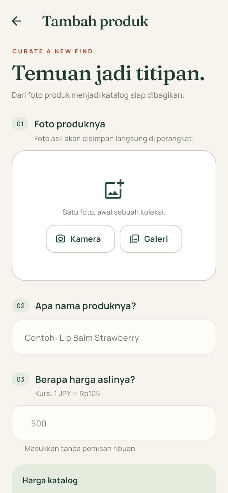

Bagian **Harga khusus produk** bersifat opsional. Aktifkan jika margin atau biaya tetap produk berbeda dari pengaturan trip. Pada **Tambahkan detail**, Anda dapat mengisi kategori, berat dalam gram, dan catatan. Nama lokasi serta titik lokasi juga opsional; lokasi yang tersimpan dapat dibuka lewat aplikasi peta jika perangkat mendukungnya. Setelah lengkap, tekan **Simpan produk**.

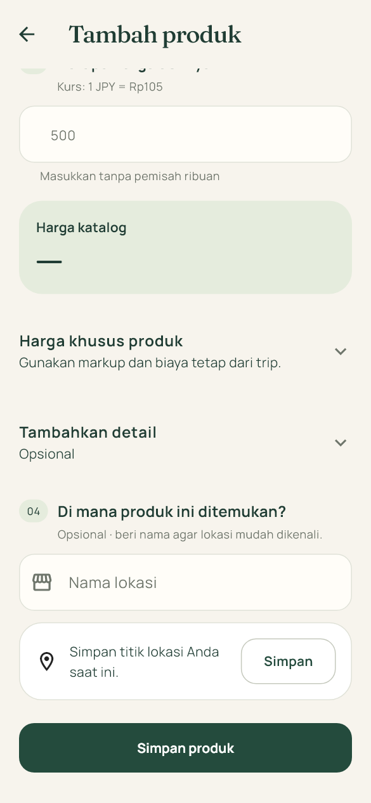

### Menemukan dan mengubah produk

Tab **Produk** menampilkan produk per kategori. Gunakan **Cari produk** atau ikon **Filter produk** untuk menyaring berdasarkan kategori, status checklist, dan ketersediaan lokasi. Tekan kartu produk untuk membuka detailnya.

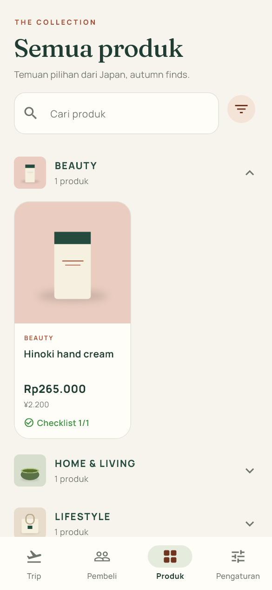

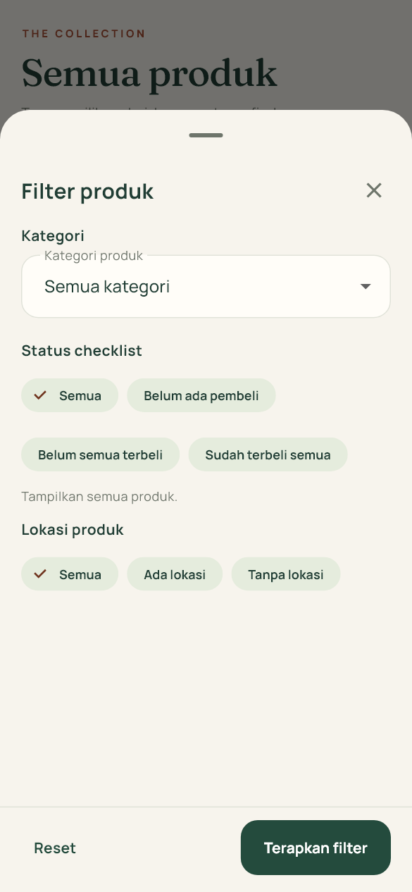

Pada halaman detail, menu **Aksi produk** menyediakan **Edit produk**, **Duplikat produk**, dan **Hapus produk**. Penghapusan produk juga menghapus gambar katalog dan checklist pembelinya; baca dialog konfirmasi sebelum melanjutkan.

### Membuat gambar katalog

Halaman detail menampilkan pratinjau gambar katalog. Tekan **Acak warna** untuk memilih tampilan warna lain, lalu gunakan ikon **Simpan ke galeri** atau **Bagikan**. Jika produk memiliki lokasi, tombol lokasi dapat membukanya di peta. Periksa kembali harga dan isi gambar sebelum dibagikan, terutama setelah kurs atau pengaturan harga diubah.

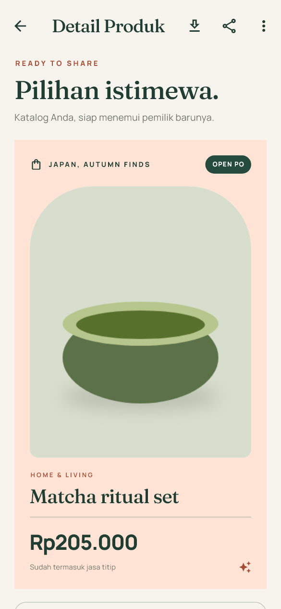

## Mencatat pembeli dan belanja

Pada halaman detail produk, bagian **Checklist pembeli** memiliki tombol **Tambah**. Isi nama pembeli, jumlah, dan catatan opsional. Anda dapat memilih nama pembeli yang sudah pernah digunakan dalam trip. Satu baris checklist mewakili titipan seorang pembeli untuk produk itu.

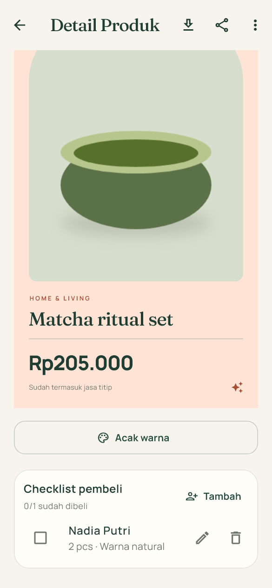

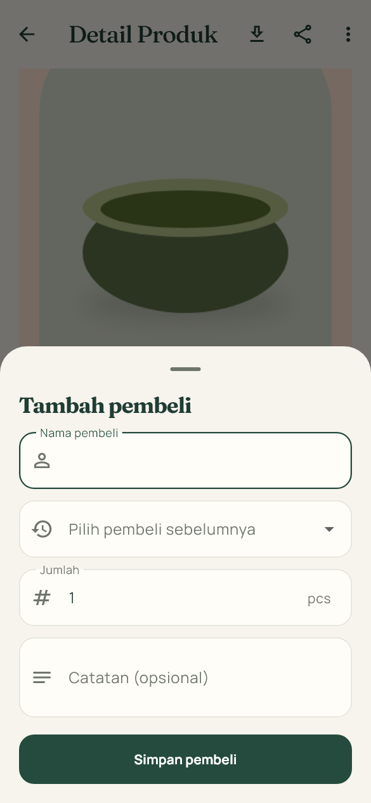

Tekan ikon **Edit pembeli** untuk mengubah nama, jumlah, atau catatan. Centang kotak di kiri nama saat titipan tersebut sudah dibeli; hilangkan centang jika status perlu dikoreksi. Ikon **Hapus pembeli** menghapus baris checklist setelah konfirmasi.

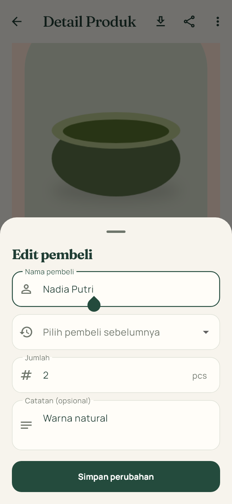

Tab **Pembeli** menggabungkan titipan berdasarkan nama pembeli dan menunjukkan produk, jumlah, nilai, serta berapa yang sudah atau belum dibeli. Untuk mengubah titipan, kembali ke detail produknya. Ringkasan belanja pada tab **Trip** mengikuti status checklist ini.

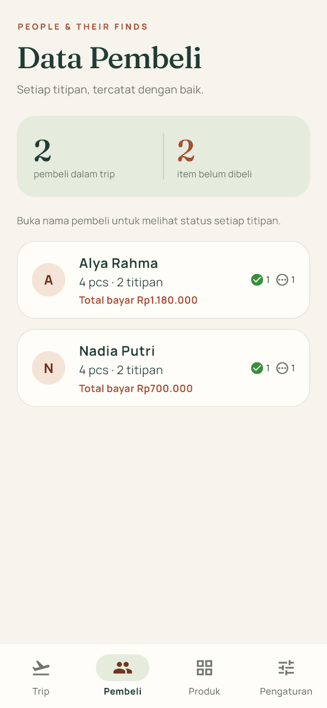

### Checklist Excel

Jika sudah ada titipan, pada tab **Trip** tekan **Ekspor Excel** untuk membuat daftar belanja. Ubah kolom status pada file checklist tersebut, lalu pilih **Impor checklist** untuk membawa statusnya kembali ke aplikasi. Impor ini memperbarui status pada tingkat produk: semua titipan pembeli untuk produk yang sama akan mengikuti status yang diimpor. Jika hanya sebagian pembeli sudah dibelikan, ubah status masing-masing melalui halaman detail produk.

## Mengekspor dan melindungi data

Di **Pengaturan → Export trip**, tekan **Export ke Excel** untuk membuat file `.xlsx` berisi sheet **Ringkasan**, **Produk**, dan **Pembeli** untuk trip aktif. File ini berguna untuk laporan; fitur **Restore** tidak menggunakan file Excel tersebut.

Di **Pengaturan → Backup & restore**, tekan **Backup** untuk membuat file `.jastip` yang mencakup trip, produk, foto, checklist pembeli, aset katalog, dan cache kurs. Simpan file hasil bagikan di tempat yang aman. Untuk memulihkan, tekan **Restore**, pilih file backup, periksa ringkasannya, lalu konfirmasi. Restore **mengganti data lokal yang sedang ada** dengan isi backup; buat backup baru terlebih dahulu jika data saat ini masih dibutuhkan.

Ikon informasi di samping judul **Pengaturan** membuka changelog aplikasi. Panduan ini menjelaskan cara memakai fitur, sedangkan [CHANGELOG.md](CHANGELOG.md) mencatat perubahan antar rilis.

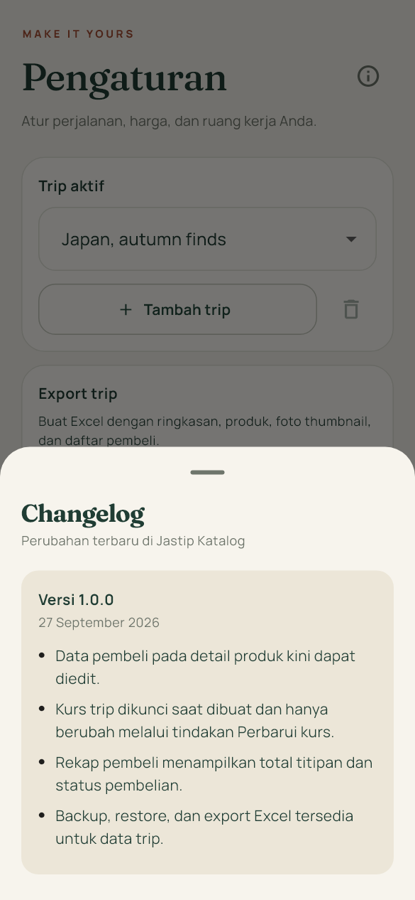

## Jika ada kendala

- **Kurs belum tersedia:** periksa koneksi dan coba **Perbarui kurs** di Pengaturan. Jika belum pernah ada kurs untuk mata uang itu, penambahan produk menunggu kurs tersedia.
- **Harga terasa berubah:** periksa apakah kurs, mata uang, markup, biaya tetap, atau pembulatan pernah diubah. Perubahan pengaturan harga menghitung ulang harga produk pada trip.
- **Pembeli atau produk tidak terlihat:** pastikan trip aktif sudah benar, lalu periksa pencarian dan filter di tab Produk.
- **Data hilang setelah berpindah browser/perangkat:** data lokal tidak tersinkron otomatis. Pulihkan dari file backup `.jastip` yang dibuat sebelumnya.
